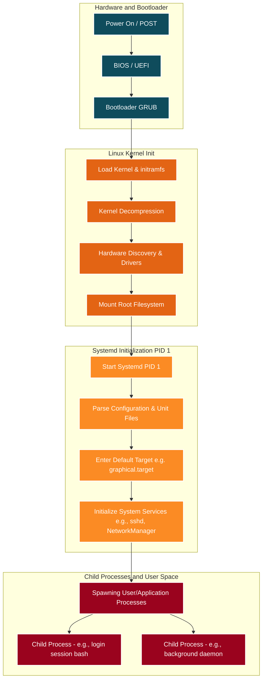
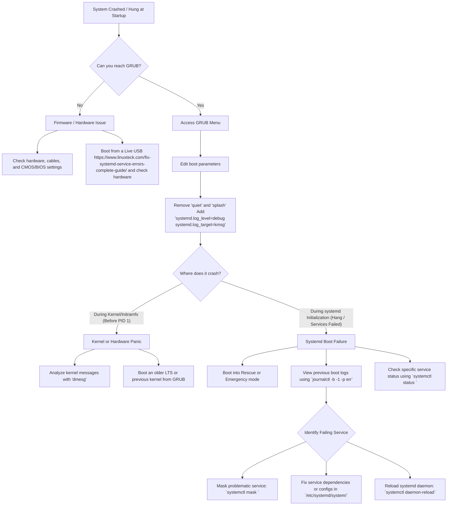

## Boot Process 

### Terminology

- **BIOS**: Basic Input/Output System
- **MBR**: Master Boot Record
- **UEFI**: Unified Extensible Firmware Interface
- **GPT**: GUID Partition Table
- **PXE**: Preboot Execution Environment
- **IPMI**: Intelligent Platform Management Interface
- **BMC**: Baseboard Management Controller
- **GRUB2**: Grand Unified Bootloader
- **initramfs**: Initial RAM Filesystem

### Commands

```sh
# Configure UEFI boot order
efibootmgr -v
------------------------------------------------------------------------------------------------
# Boot Loader Configuration
cat /etc/default/grub
# If you change this file, run 'update-grub' afterwards to update
# /boot/grub/grub.cfg.
# For full documentation of the options in this file, see:
#   info -f grub -n 'Simple configuration'

GRUB_DEFAULT=0
GRUB_TIMEOUT_STYLE=hidden
GRUB_TIMEOUT=0
GRUB_DISTRIBUTOR=`( . /etc/os-release; echo ${NAME:-Ubuntu} ) 2>/dev/null || echo Ubuntu`
------------------------------------------------------------------------------------------------

```

### Kernel

```sh
# View initramfs contents
~$ lsinitramfs /boot/initrd.img-$(uname -r) | head -10
.
usr
usr/lib
usr/lib/firmware
usr/lib/firmware/3com
usr/lib/firmware/3com/typhoon.bin.zst
usr/lib/firmware/acenic
usr/lib/firmware/acenic/tg1.bin.zst
usr/lib/firmware/acenic/tg2.bin.zst
usr/lib/firmware/adaptec

# List loaded kernel modules
~$ lsmod

Module                  Size  Used by
uas                    32768  0
usb_storage            90112  1 uas
qrtr                   49152  2
input_leds             12288  0
joydev                 36864  0
hid_generic            12288  0
cfg80211             1261568  0
snd_hda_codec_generic   114688  1

# Load a module manually
~$ sudo modprobe joydev
```

### Systemd

After the kernel mounts the root filesystem, it starts systemd as PID 1. systemd manages all services and brings the system to the desired state (target).

### Troubleshooting Boot Failures

```sh
# At GRUB screen

# If GRUB menu appears, press 'e' to edit boot entry
# Add to the linux line for debugging:
#   systemd.unit=rescue.target     → Boot to rescue mode (single user)
#   systemd.unit=emergency.target  → Boot to emergency mode (minimal)
#   init=/bin/bash                 → Drop to shell (no systemd at all)
#   rd.break                      → Break before initramfs hands off to rootfs

~$ systemctl list-units --state=failed        # List failed services
~$ systemctl --failed                         # Same, shorter
~$ systemctl list-dependencies multi-user.target  # Show dependency tree

~$ journalctl -b -1 -p err                   # Errors from previous boot

Jun 26 21:54:18 ubuntu-lab systemd[1]: Failed to start rsyslog.service - System Logging Service.
Jun 26 21:54:23 ubuntu-lab login[854]: PAM unable to dlopen(pam_lastlog.so): /usr/lib/security/pam_lastlog.so: cannot open shared object file: No such file or directory
Jun 26 21:54:23 ubuntu-lab login[854]: PAM adding faulty module: pam_lastlog.so

~$ systemd-analyze blame | head -20           # Slowest services
5.431s systemd-networkd-wait-online.service
 339ms dev-mapper-ubuntu\x2d\x2dvg\x2dubuntu\x2d\x2dlv.device
 257ms snapd.seeded.service
 211ms snapd.service
 118ms apparmor.service
 107ms sys-kernel-debug.mount

~$ systemd-analyze critical-chain
The time when unit became active or started is printed after the "@" character.
The time the unit took to start is printed after the "+" character.

graphical.target @6.196s
└─multi-user.target @6.196s
  └─apport.service @6.118s +78ms
    └─remote-fs.target @6.117s
      └─remote-fs-pre.target @6.116s

```



### Troubleshoot Startup

