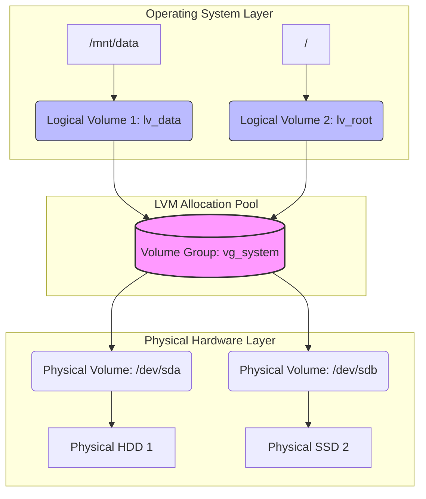
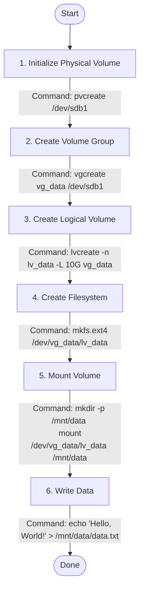

## Disks and Volumes

A Linux system sees physical disks as device files like `/dev/sda` or `/dev/nvme0n1`. These raw disks need a layer of organization before the operating system can use them efficiently.

**Logical Volume Management (LVM)** bridges the gap between physical hard drives and the operating system. Instead of working with fixed disk partitions, LVM lets you pool storage from multiple disks and carve out flexible virtual partitions on demand.

The abstraction has three layers:

- **Physical Volumes:** The actual physical disks or partitions.
- **Volume Groups:** A pool of storage that collects one or more physical volumes.
- **Logical Volumes:** Virtual partitions carved from a volume group, which hold a filesystem.

The diagram below shows how these layers fit together, from the physical hardware up to the directories the operating system sees:

### Creating a Logical Volume

Setting up a logical volume takes six steps, from initializing the physical disk to writing data. The following flowchart outlines the full process, with the corresponding command at each stage:

### References

- [LVM](https://ubuntu.com/server/docs/explanation/storage/about-lvm/)