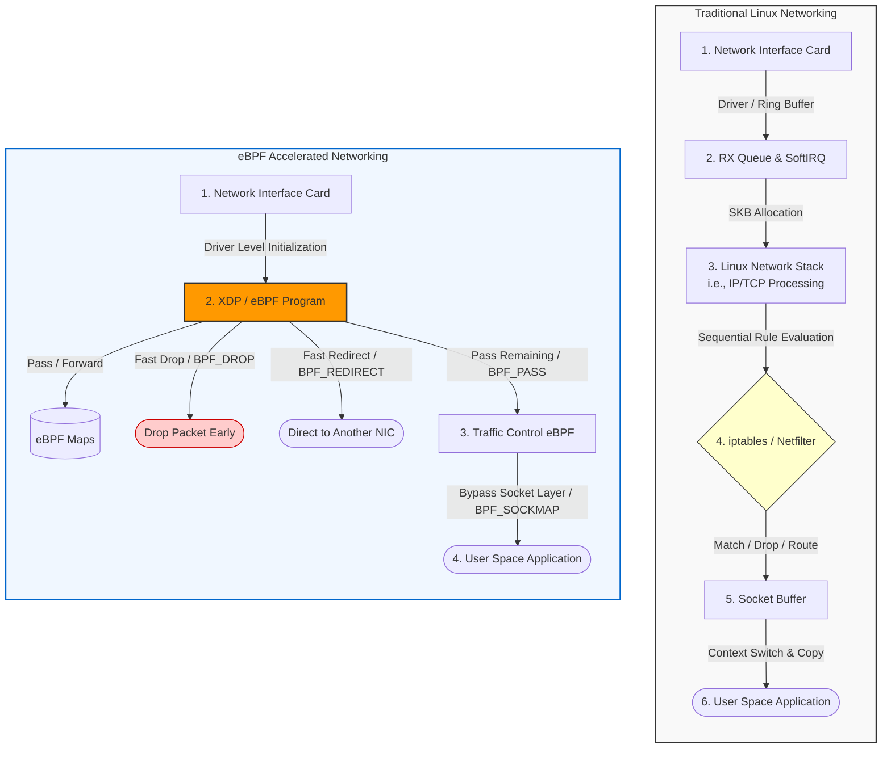
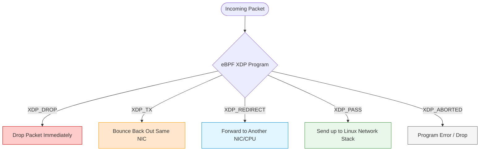

## eBPF

In the past, adding advanced networking features meant routing every packet through a user-space agent or writing custom kernel modules. Both approaches came with serious trade-offs.

Traditional networking suffers from several problems:

- **High Latency and Overhead:** Classic tools like iptables evaluate rules one after another in a long, linear chain. Checking every packet against this entire sequence creates significant delays.
- **Context Switches:** Inspecting and routing packets often requires copying data between kernel space and user space. Every switch between these two layers eats up CPU cycles and slows things down.
- **Lack of Flexibility:** iptables and the traditional routing stack were built long before containers, microservices, and dynamic cloud-native environments became the norm. They simply weren't designed for today's infrastructure.

eBPF (Extended Berkeley Packet Filter) changes the game. It lets developers run sandboxed programs directly inside the Linux kernel, without modifying kernel source code or loading risky modules.

Here is how eBPF solves the problems above:

- **Constant Time Lookups:** Instead of walking through a chain of rules, eBPF uses hash tables (called maps) to look up policies and routing paths in a single, predictable step.
- **XDP (eXpress Data Path):** With XDP, eBPF programs can process packets the moment they arrive at the network interface card — before the kernel's main network stack even touches them. This delivers maximum throughput.
- **Reduced Context Switches:** eBPF filters, routes, and collects metrics right where the packet lands. There is no need to copy raw data up to user space, which cuts down on overhead dramatically.
- **Built-in Safety (The Verifier):** Before any eBPF program runs, the kernel puts it through a strict validator. This verifier checks for infinite loops, unauthorized memory access, and other dangerous behavior. If the program doesn't pass, it never executes.

For reference, here is a diagram that compares traditional Linux networking side-by-side with eBPF-accelerated networking:

### Core XDP Verdict Actions

XDP (eXpress Data Path) programs must return one of five verdict actions that tell the kernel what to do with a packet. The following diagram shows each possible verdict and its effect:

### References

- [eBPF](https://www.linuxfoundation.org/hubfs/eBPF/The_State_of_eBPF25_111925.pdf)
- [Netkit](https://isovalent.com/blog/post/cilium-netkit-a-new-container-networking-paradigm-for-the-ai-era/)
- [Cloudfare Ddos](https://blog.cloudflare.com/defending-the-internet-how-cloudflare-blocked-a-monumental-7-3-tbps-ddos/)
- [eBPF Applications](https://ebpf.io/applications/)