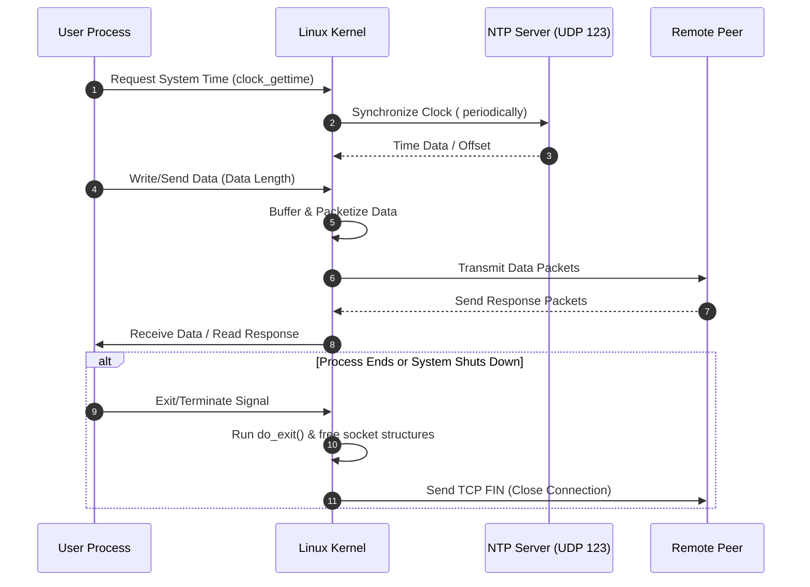

## Network Packet Flow

This document explains how a network packet travels through the Linux system from the kernel's perspective.

The following diagram illustrates the overall flow of network communication between a user process, the Linux kernel, an NTP server, and a remote peer:

The key topics covered are:

- How a process retrieves network time
- How data length (input request or output response) affects response times
- When a connection to a process closes

### How a Process Gets Network Time

System daemons like `chronyd` or `ntpd` continuously talk to external time servers and update the system clock. When a process needs to know the current time — for example, to add a timestamp to a packet — it calls a kernel system call. For packet-level network timestamps, the kernel stamps incoming or outgoing packets using socket options such as `SO_TIMESTAMP`. This records the exact moment a packet reaches the network stack.

### How Data Length Impacts Response Times

When a process generates a response, the kernel places it in the send queue. If the response exceeds the Maximum Transmission Unit (MTU), the kernel breaks it into multiple smaller packets. Larger payloads require more CPU cycles to serialize and deserialize, which can slow things down.

Network latency depends on how many packets need to be sent. More packets mean a higher chance of packet loss, retransmissions, and queuing delays.

### When a Connection Closes

All open network connections close under two scenarios:

- **Process ends:** The kernel's `do_exit()` routine runs, looping through all file descriptors belonging to the process — including network sockets — and closes them. This triggers a graceful TCP teardown (FIN/ACK sequence) with the remote peer.
- **System shuts down:** The system sends termination signals to all running processes. The kernel forcefully tears down any remaining connections as it stops networking services and unmounts filesystems.

### Packet Processing When a Process Is OOM Killed

What happens to packets depends on where they are in the pipeline when the Out-Of-Memory (OOM) killer terminates the process.

#### In-Flight Packets

- Packets being processed are dropped. The OS reclaims memory and clears any in-memory packets.
- If there are active TCP connections, the kernel sends a TCP reset (RST) packet to the remote client. This terminates the connection instead of leaving clients hanging.

#### Packets from New Requests

- Packets that arrive after the process has died still reach the kernel's network stack. If the process does not restart in time, the kernel's receive buffer fills up and eventually drops incoming packets.
- Depending on firewall and kernel settings, the server may send an ICMP Destination Unreachable message back to the sender.

#### Previously Processed Packets

- Packets that were fully processed before the OOM event — and successfully saved to a database, forwarded to another service, or written to disk — are safe.
- If the process was in the middle of writing processed data to a file or database when it was killed, that specific transaction might be corrupted or incomplete.

### Preventing Network Timeouts

- **Tune OOM scoring:** Adjust `oom_adj` and `oom_score_adj` for critical network services so the kernel kills less important tasks first instead of network daemons.
- **Buffer tuning:** Increase the size of receive buffers (`net.core.rmem_max` and `net.core.rmem_default`) to give the OS more time to queue packets.
- **Memory limits:** Configure appropriate memory limits to reduce the likelihood of OOM events affecting network services.

### References

- [Lifecycle of a Packet](https://emmanuelbashorun.medium.com/lifecycle-of-a-packet-through-the-linux-kernel-51301793df5d)
- [TCP IP Stack Tuning](https://linuxgd.medium.com/advanced-tcp-ip-stack-tuning-techniques-in-linux-6fdfdbaf1ad5)