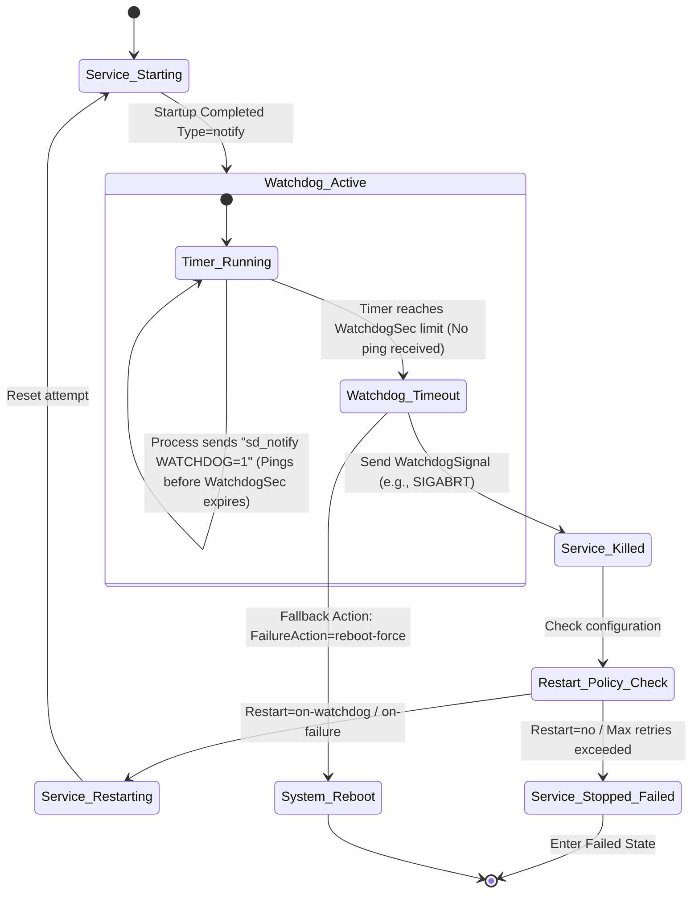

## Systemd

The process in linux system which runs as PID 1.

Before systemd, a typical production host had SysV Init scripts for daemon, cronjobs, syslog, `/etc/fstab` for mounts. All these are folded into one single declarative unit-format file with systemd, journalctl.

Every process lives in a controlgroup known as cgroup. Systemd uses cgroup v2 as default for all processes.

Systemd manages units. Below are different unit types

| Unit Type | Typical Purpose |
|-----------|-----------------|
| **.service** | Runs a background or foreground process (daemon). |
| **.socket** | Provides socket activation for services. |
| **.timer** | Triggers services or other units on a schedule. |
| **.mount** | Manages filesystem mounts. |
| **.automount** | Mounts filesystems on demand. |
| **.path** | Triggers units when files or directories change. |
| **.slice** | Groups units into a cgroup slice for resource control. |
| **.target** | Logical grouping of units, used for ordering. |
| **.scope** | Represents a collection of processes not owned by systemd. |
| **.device** | Represents a device node in the system. |
| **.swap** | Manages swap space. |

Example systemd unit file which would be in ini format

```
[Unit]
Description=Example Production Application Service
Documentation=man:exampleapp(1) https://example.com
Requires=network.target postgresql.service
Wants=redis.service
After=network-online.target postgresql.service
Before=multi-user.target
BindsTo=systemd-networkd.service
PartOf=my-app.target
OnFailure=failure-handler.service

[Service]
Type=simple
Environment=PORT=8080 CONFIG_FILE=/etc/example/config.json
EnvironmentFile=-/etc/example/environment.env
PIDFile=/run/exampleapp.pid
ExecStart=/usr/bin/exampleapp -c $CONFIG_FILE
ExecStartPre=/usr/bin/echo "Starting application preparation..."
ExecStartPost=/usr/bin/echo "Application successfully started."
ExecReload=/bin/kill -HUP $MAINPID
ExecStop=/bin/kill -TERM $MAINPID
ExecStopPost=/usr/bin/echo "Cleanup complete."
Restart=on-failure
RestartSec=5s
TimeoutStartSec=30s
TimeoutStopSec=10s
StartLimitIntervalSec=60s
StartLimitBurst=3
User=appuser
Group=appgroup
WorkingDirectory=/opt/exampleapp
RootDirectory=/opt/exampleapp/chroot
CapabilityBoundingSet=CAP_NET_BIND_SERVICE CAP_SYS_CHROOT
NoNewPrivileges=yes
PrivateTmp=yes
ProtectSystem=strict
ProtectHome=read-only
StandardOutput=journal
StandardError=inherit
SyslogIdentifier=exampleapp

[Install]
WantedBy=multi-user.target
RequiredBy=my-app.target
Alias=example.service app.service

```

### Updating Files

We should avoid updating the configuration files coming from packages as next `dnf upgrade` or `apt upgrade` would overwrite them. We use drop-ins

```sh 
sudo systemctl edit test.service # creates /etc/systemd/system/test.service.d/override.conf

systemctl cat test.service # View merged unit 

systemd-analyze cat-config systemd/system.conf # Show every config that contributes
 
```

The empty-key reset trick: List-valued keys (most notably ExecStart=, Environment=) accumulate across drop-ins. To replace rather than append, set the key to empty first:

```
[Service]
ExecStart=
ExecStart=/opt/test-custom/sbin/test -g 'daemon off;'
```

After drop-in changes, we need to restart services using

```
sudo systemctl daemon-reload
sudo systemctl restart test
```

### Watchdog


